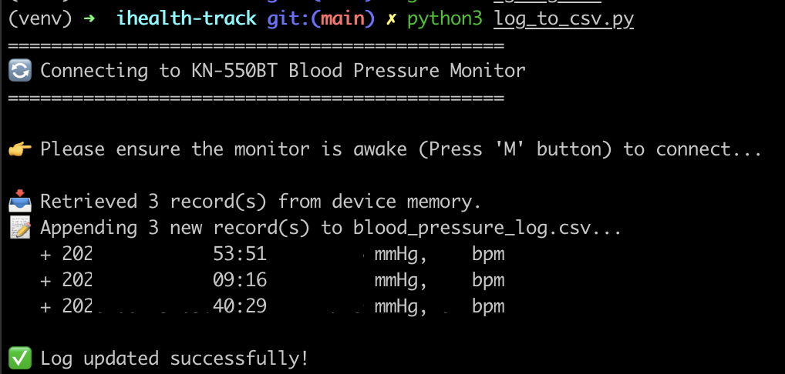

# [iHealth Track KN-550BT](https://amzn.to/49V9IO3) Data Puller

## Privacy friendly, completely local BP health downloader


A Python library and script to securely authenticate and download offline blood pressure readings directly from an [iHealth Track (KN-550BT)](https://amzn.to/49V9IO3) monitor over Bluetooth, bypassing the official app. Also will set the date and time on the device.

## Requirements
- Python 3.7+
- macOS/Linux/Windows with Bluetooth LE support

## Setup

1. Create and activate a Python virtual environment:
   ```bash
   python3 -m venv venv
   source venv/bin/activate  # On Windows: venv\Scripts\activate
   ```

2. Install the required BLE library:
   ```bash
   pip install bleak
   ```

## Usage

1. **Wake the device:** Press the **M** (Memory) button once on the blood pressure monitor to turn on the screen and activate Bluetooth.
2. **Run the logger:**
   ```bash
   python log_to_csv.py
   ```

*Note on First Run (Pairing): The script will automatically scan for the monitor and save its UUID if `device_config.txt` is missing. Just tap the **M** button once to wake the device, and the script will find it and pair.*

### Options
To view raw hex packet transmissions and debug the protocol:
```bash
python log_to_csv.py --debug
```

## Notes

The project is split into two layers:
1. `kn550bt.py`: The core library. Exposes a clean `KN550BT_Client` that handles all Bluetooth communication, encryption (`XXTEA2`), and raw byte-parsing. It returns clean `BloodPressureRecord` python objects.
2. `log_to_csv.py`: The consumer application. Imports the core library, retrieves the readings, and appends them to a CSV log file while strictly preventing duplicates.


### Note on Device Memory (Unread Queue)
By default, this script **does not** delete or mark records as "read" on the physical blood pressure monitor. It uses CSV timestamp deduplication to avoid writing the same reading twice. This allows you to still scroll through your history manually on the device's physical screen.

*Future Implementation:* If you ever wish to clear the device's "Unread" queue so it stops transmitting old data over Bluetooth, you can implement the `0x47` ("Transfer Finished") command in `kn550bt.py`. Sending `bytes([0xA1, 0x47, 0x00, 0x00, 0x00])` after a successful data pull will instruct the device to clear its offline queue.
